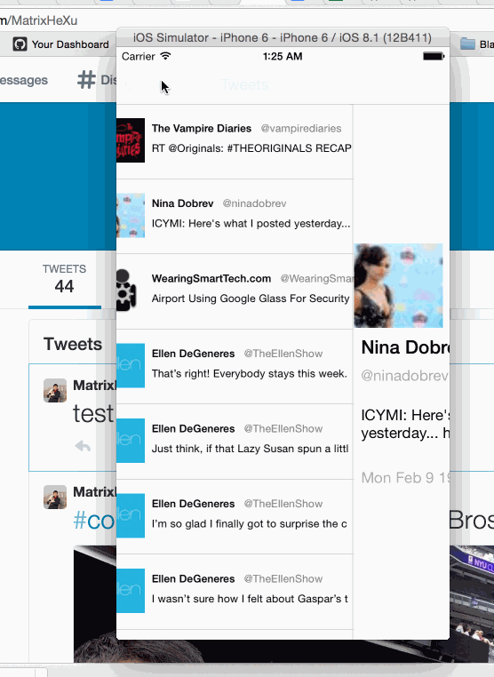

#Twitter
Time Spent: 6 hours

Completed functions:

* [x] Required: 

1. User can sign in using OAuth login flow

2. The current signed in user will be persisted across restarts 

3. In the home timeline, user can view tweet with the user profile picture, username, tweet text, and timestamp. In other words, design the custom cell with the proper Auto Layout settings. You will also need to augment the model classes. 

4. User can compose a new tweet by tapping on a compose button. 

    GIF created with [LiceCap](http://www.cockos.com/licecap/).
